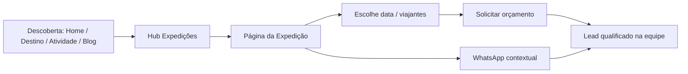

# ABC FLY EXPEDITIONS — Auditoria Completa + Arquitetura da Nova Plataforma

**Status:** Aguardando aprovação antes do desenvolvimento  
**Data:** 10 de agosto de 2026  
**Site auditado:** https://www.abcflyexpeditions.com  
**Modelo atual:** Wix Stores (roteiros como produtos de e-commerce)

---

## 1. Veredito executivo

A ABC Fly Expeditions já possui **fotografia forte**, **identidade recognizável** (azul + verde lima + “Explore Everything”) e **conteúdo de roteiros com potencial**. O problema central não é falta de desejo — é um **modelo digital errado**: expedições tratadas como produtos de loja, páginas pobres para conversão consultiva, navegação confusa e gestão operacional frágil (datas, orçamentos, conteúdo).

A marca promete **jornada curada e personalizada**. O site atual vende a sensação de **catálogo de loja**. Isso reduz confiança, dificulta a solicitação de orçamento e impede que a empresa se posicione no nível de National Geographic Expeditions / Lindblad.

**Não devemos apenas redesenhar.** Devemos **reconstruir a plataforma** em torno de:

1. Expedições como páginas de experiência (não produtos)
2. Orçamento inteligente como conversão principal
3. Datas editáveis sem código
4. Loja de equipamentos como módulo separado
5. Blog integrado à jornada de descoberta

---

## 2. Inventário do site atual

### 2.1 Plataforma e escala

| Tipo | Quantidade | Observação |
|------|------------|------------|
| Páginas estáticas | 31 | Inclui cópias (`/cópia-*`) e typos (`/ameerica-do-norte`) |
| Produtos (roteiros) | 30 | Em `/product-page/...` via Wix Stores |
| Categorias de loja | 22 | Inclui `todas-as-roupas`, `all-products` |
| Posts de blog | 10 | RSS ativo; experiência no site frágil |
| Domínio secundário | 1 | `abcexpshop.com` (Explorer Shop) |

### 2.2 Navegação atual

`DESTINOS` · `CATEGORIAS` · `INSPIRE-SE` · `CONTATO` · `SOBRE NÓS` · `EXPLORER SHOP`

Problema: **dois eixos de descoberta competindo** (destino × atividade) sem hierarquia clara, mais um link externo de loja no mesmo nível das expedições.

### 2.3 Categorias de atividade (páginas editoriais)

Surf, Trekking, Bike, Fotografia, Kayaking & Rafting, Snorkeling & Diving, Natureza & Vida Selvagem, Navegações, História & Arqueologia, Snowboard & Skiboard, Kitesurf, Povos & Culturas (+ Inspire-se / Volunteer).

### 2.4 Destinos continentais

América do Sul, América Central, América do Norte, África, Ásia, Europa, Oceânia, Antártica.

### 2.5 Exemplos de roteiros atuais

Antártica (MV Ushuaia), Antarctica 21, Silversea Alasca, Aria Amazon, Kilimanjaro, Everest Base Camp, Torres del Paine, Escócia de Bike, Chapada dos Veadeiros, Costa Rica, Namíbia, Quênia, Uganda, Tailândia, Indonésia, Maldivas, Finlândia (Aurora), Islândia, Yellowstone–Grand Canyon, etc.

### 2.6 Proposta de valor encontrada (preservar)

> “As melhores experiências acontecem onde o mapa não grita, mas sussurra.”  
> Braço de aventura da **ABC FLY Viagens e Turismo** (21+ anos).  
> Lema: **Explore Everything**.  
> Posicionamento: aventura + curadoria + segurança + sofisticação.

### 2.7 Evidências visuais da auditoria

Salvas em `docs/audit-assets/`:

- Home (hero / mobile)
- Página de categoria (Navegações)
- Página de produto (Alasca — padrão e-commerce)
- Contato e Sobre Nós

---

## 3. Diagnóstico por dimensão

### 3.1 Modelo de negócio vs. interface (problema #1)

**O que acontece hoje**  
Roteiros são `Product` no schema, com preço, SKU, quantity e URL `/product-page/`.

**Por que existe**  
Wix Stores foi usado como atalho para catálogo. É o caminho mais fácil no Wix, não o mais correto para turismo consultivo.

**Impacto**  
- Sensação de e-commerce barato em produto premium  
- Expectativa de compra imediata que a empresa não oferece  
- Impossibilidade natural de campos ricos (nível, época, FAQ, mapa, datas múltiplas)  
- Schema.org incorreto para SEO de viagem

**Solução**  
Substituir “produto” por **Expedição** (content type próprio) com CTA único: **Solicitar orçamento**.

---

### 3.2 Página de roteiro pobre para decisão

**O que acontece hoje**  
Em vários roteiros, a descrição é um bloco único de texto (às vezes truncado), galeria estilo loja, preço “A partir de”, badge “ROTEIRO ADAPTÁVEL” e botão genérico “Explorar agora”.

**Por que existe**  
Template de produto Wix não foi desenhado para storytelling de expedição.

**Impacto**  
O visitante não consegue visualizar a jornada, avaliar dificuldade, comparar datas ou confiar o suficiente para pedir orçamento.

**Solução**  
Template de expedição com seções obrigatórias (ver §6.3).

---

### 3.3 Conversão ambígua

**O que acontece hoje**  
CTAs: “Explorar”, “Explorar agora”, “Ver viagens…”. Formulário genérico de contato sem vínculo automático ao roteiro/data.

**Por que existe**  
Falta de definição do funil: a conversão não foi modelada como “lead de expedição”, e sim como “contato”.

**Impacto**  
Equipe precisa descobrir manualmente origem do lead; fricção e perda de taxa de orçamento.

**Solução**  
Formulário contextual por expedição + payload completo (expedição, data, viajantes, origem da página).

---

### 3.4 Datas sem sistema operacional

**O que acontece hoje**  
Datas não aparecem de forma clara/atualizável por roteiro. Conteúdo de saída depende de edição manual espalhada.

**Por que existe**  
Não há entidade “Departure / Saída”. Preço e texto misturam-se no produto.

**Impacto**  
Informação desatualizada = perda de confiança e retrabalho constante.

**Solução**  
Tabela/CMS de **Saídas** ligada a cada expedição; edição sem código.

---

### 3.5 Arquitetura de informação confusa

**Problemas concretos**

| Problema | Evidência | Causa | Efeito |
|----------|-----------|-------|--------|
| Destinos × Categorias sobrepostos | Dois hubs sem relação clara | Taxonomia inventada no Wix | Usuário não sabe por onde começar |
| Páginas duplicadas/órfãs | `/cópia-historia-e-arqueologia`, `/cópia-snowboard-e-skiboard` | Cópias de edição não limpas | SEO e navegação poluídos |
| Typo em URL | `/ameerica-do-norte` | Erro humano sem revisão | Link quebrado / autoridade diluída |
| Categorias fantasma de loja | `todas-as-roupas`, `all-products` | Template de moda/loja | Quebra de posicionamento |
| Typos de categoria | `snotkling-e-diving`, `snorkling-e-diving` | Sem glossário editorial | Credibilidade e SEO |
| Inspire-se desalinhado | Volunteer projects em inglês | Conteúdo paralelo sem integração | Jornada quebrada |
| Explorer Shop no nav principal | Link para `abcexpshop.com` | Loja forçada no mesmo menu | Distrai do funil de expedições |

---

### 3.6 Blog desconectado

**O que acontece hoje**  
Há posts (Peru, Bali, Ushuaia, snowboard, mergulho, bike Escócia…), mas a experiência de blog no site é frágil e **não sugere expedições relacionadas**.

**Por que existe**  
Blog Wix como silo; sem modelo de relacionamento conteúdo ↔ roteiro.

**Impacto**  
Perde autoridade, SEO e ponte inspiração → orçamento.

**Solução**  
Artigos com tags de destino/atividade + bloco “Expedições relacionadas”.

---

### 3.7 Credibilidade incompleta

**Pontos fortes atuais:** Cadastur, selo eco, telefone, redes, 21 anos da matriz, fotografia.  
**Lacunas:** poucos depoimentos, sem equipe, sem FAQ global, sem prova social nas páginas de roteiro, sem cases com fotos reais de clientes, políticas pouco acessíveis no fluxo.

---

### 3.8 Design e performance

**Pontos fortes:** fotos excelentes; cores de marca memoráveis.  
**Limitações:** nav bar pesada; hero competindo com formulário longo; tipografia pouco premium; animações/presença limitadas; páginas Wix pesadas (HTML >1MB em várias rotas); acessibilidade irregular (contraste em overlays, alvos de toque).

---

### 3.9 SEO técnico

- Schema `Product` para viagem (incorreto)
- URLs longas com “a-partir-de”
- Páginas duplicadas indexáveis
- Conteúdo dia-a-dia em bloco único (difícil featured snippets / rich results)
- Títulos inconsistentes e truncados

---

## 4. Matriz de problemas × prioridade

### P0 — Crítico (fundação do negócio)

| # | Problema | Por que existe | Solução |
|---|----------|----------------|---------|
| P0.1 | Roteiros como produtos de loja | Wix Stores como CMS | Content type Expedição + template editorial |
| P0.2 | CTA não é “solicitar orçamento” | Funil não definido | CTA único e sticky; copy direto |
| P0.3 | Lead sem contexto do roteiro/data | Form genérico | Form inteligente contextual |
| P0.4 | Datas sem gestão simples | Sem entidade Saída | CMS/tabela de saídas |
| P0.5 | Loja misturada com expedições | Shop no nav principal | Módulo `/loja` isolado, nav secundária |

### P1 — Alto (conversão e confiança)

| # | Problema | Solução |
|---|----------|---------|
| P1.1 | Página de roteiro sem estrutura rica | Template completo (§6.3) |
| P1.2 | IA confusa (destino/atividade) | Hub único Explorar + filtros |
| P1.3 | Blog sem relação com expedições | Related expeditions |
| P1.4 | Prova social fraca | Depoimentos, fotos reais, selos no fluxo |
| P1.5 | URLs/páginas sujas | Redirects 301 + limpeza |
| P1.6 | Mobile e hierarquia do hero | Hero fotográfico limpo; form no momento certo |

### P2 — Médio (marca e escala)

| # | Problema | Solução |
|---|----------|---------|
| P2.1 | Tipografia/visual ainda “site de agência” | Sistema visual premium exclusivo |
| P2.2 | Performance Wix | Stack moderna (Next.js + CMS) |
| P2.3 | SEO de viagem incompleto | Schema TouristTrip / FAQ / Breadcrumb |
| P2.4 | Inspire-se / volunteer órfão | Integrar em Experiências ou conteúdo |
| P2.5 | Multilíngue futuro | i18n na arquitetura desde o início |

### P3 — Evolução

Comparador de expedições, área do viajante, wishlist, chat assistido, vídeos 360, programa comunidade, e-commerce completo de equipamentos.

---

## 5. Princípios extraídos das referências (sem copiar)

| Referência | Princípio a absorver | Como aplicar na ABC Fly |
|------------|----------------------|-------------------------|
| Nat Geo Expeditions | Fotografia como narrativa; autoridade científica/exploratória | Hero full-bleed; curadoria e experts visíveis |
| Lindblad | Expedição como experiência profunda; detalhe operacional gera confiança | Dia a dia, navio/equipe, FAQs, transparência |
| Apple | Hierarquia brutalmente clara; um foco por seção | Seções com um job; menos UI |
| Nike / TNF / Oakley | Energia, movimento, produto como identidade | Motion sutil; sensação de liberdade e performance |

**Identidade ABC Fly (única):**  
Aventura sofisticada brasileira — selvagem na imagem, precisa na operação, humana na curadoria.  
Não “loja de pacotes”. Não “cruzeiro genérico”. **Exploração com propósito.**

---

## 6. Arquitetura proposta da nova plataforma

### 6.1 Stack recomendada

| Camada | Escolha | Motivo |
|--------|---------|--------|
| Frontend | **Next.js (App Router) + TypeScript** | Performance, SEO, rotas ricas, i18n |
| Estilo | **CSS Modules / Tailwind com design tokens** | Sistema visual controlado |
| CMS | **Sanity** (ou Payload) | Editor visual simples para datas/roteiros/blog |
| Forms / CRM | **Resend/Email + webhook (HubSpot/Notion/Sheets)** | Lead com payload completo |
| Mídia | CDN + image optimization nativa | Fotos grandes sem peso |
| Analytics | GA4 + eventos de funil | Medir orçamentos por expedição |
| Loja futura | Módulo separado (Shopify Headless **ou** Medusa) | Isolamento do funil de expedições |

> Alternativa “mais simples operacionalmente”: Webflow/Framer + CMS — **não recomendada** se o objetivo é referência mundial + loja futura + lógica de saídas/orçamentos.

### 6.2 Mapa de informação (IA)

```text
/
├── expedicoes/                    # Hub de descoberta (filtros: destino, atividade, duração, nível, época)
│   └── [slug]/                   # Página rica da expedição
├── destinos/
│   └── [continente|pais]/
├── atividades/
│   └── [atividade]/
├── blog/
│   └── [slug]/
├── sobre/
├── como-viajamos/                 # Método, segurança, sustentabilidade, Cadastur
├── depoimentos/
├── faq/
├── contato/
├── solicitar-orcamento/           # Também embutido nas expedições
├── loja/                          # Módulo independente (fase 2+)
│   ├── [categoria]/
│   └── [produto]/
└── legal/
    ├── privacidade/
    ├── cookies/
    └── termos/
```

**Navegação principal (máx. 5–6 itens):**  
`Expedições` · `Destinos` · `Atividades` · `Diário` (blog) · `Sobre` · `Contato`  
`Loja` fica como item secundário (footer / utilitário), nunca competindo com orçamento.

### 6.3 Template obrigatório da página de Expedição

1. **Capa impactante** (full-bleed, marca + nome da expedição + 1 linha + CTA)
2. **Barra de fatos** (duração, nível, melhor época, grupo, a partir de)
3. **Story / essência** (por que esta jornada)
4. **Galeria** (+ vídeo opcional)
5. **Destaques** (5–7 momentos)
6. **Roteiro dia a dia** (accordion acessível)
7. **Mapa** do percurso
8. **Inclui / Não inclui**
9. **Datas e saídas** (tabela viva do CMS)
10. **Informações importantes** (visto, vacina, condicionamento, idioma)
11. **FAQ** da expedição
12. **Prova social** relacionada
13. **Formulário de orçamento** (sticky CTA no mobile)
14. **Expedições relacionadas** + artigos do Diário

**Proibido na UI de expedição:** carrinho, quantidade, SKU visível, “comprar”, layout de PDP de loja.

### 6.4 Modelo de dados (CMS)

```text
Expedition
- title, slug, hero, gallery[], videoUrl?
- summary, story (rich text)
- destination[] (refs), activity[] (refs)
- durationDays, difficulty (1-5), bestSeason
- highlights[], dayByDay[{day, title, body}]
- map (geo/embed), includes[], excludes[]
- importantInfo[], faq[]
- priceFrom? (opcional, “a partir de”)
- relatedExpeditions[], relatedPosts[]
- seo{title, description, ogImage}

Departure (Saída)  ← editável em tabela
- expedition (ref)
- startDate, endDate
- status: available | limited | waitlist | soldout | custom
- notes (ex.: “cabine twin”, “com guia PT”)
- seatsLeft? (opcional)

QuoteRequest
- expedition, departure?, travelers, name, email, phone
- message, pageUrl, utm*, createdAt

Post (Blog)
- title, slug, hero, body, tags
- relatedExpeditions[]

Product (Loja – fase 2)
- isolado do modelo Expedition
```

**Gestão de datas (requisito do brief):**  
Painel Sanity com vista tabela de `Departure`. Operação edita só data/status/vagas. Site atualiza automaticamente. Zero código.

### 6.5 Formulário inteligente de orçamento

Campos mínimos:

- Nome
- E-mail
- WhatsApp/telefone
- Expedição (pré-preenchida)
- Data/saída (select das saídas ativas **ou** “datas flexíveis”)
- Nº de viajantes
- Perfil (solo / casal / família / grupo)
- Mensagem
- Consentimento LGPD

**Envio automático para a equipe deve incluir:**  
expedição, slug/URL, data escolhida, viajantes, UTM, timestamp.  
Canais: e-mail estruturado + planilha/CRM + opcional WhatsApp Business API.

Estados de UX: loading, sucesso (“Recebemos. Retorno em até Xh úteis.”), erro recuperável.

### 6.6 Home — composição da primeira dobra

Uma composição só (não dashboard):

- Marca hero-level
- Uma headline
- Uma frase de apoio
- Um grupo de CTA (`Ver expedições` / `Solicitar orçamento`)
- Uma fotografia dominante full-bleed

**Fora da primeira dobra:** formulário longo, grades de destino, stats, blog, etc.

### 6.7 Fluxos principais (CRO)



Microconversões a medir: view expedição → abrir dia a dia → selecionar data → submit orçamento → WhatsApp click.

### 6.8 Blog / Diário

Papéis dos artigos:

- Inspiração (narrativa de viagem)
- Planejamento (melhor época, packing, nível)
- Destino (guias)
- Autoridade (método ABC Fly, segurança, sustentabilidade)

Cada post termina com **expedições relacionadas** + CTA de orçamento.

### 6.9 Módulo Loja (fase futura, já previsto)

- Namespace `/loja`
- Design system compartilhado, **catálogo e checkout isolados**
- Nav: entrada discreta (“Equipamentos”)
- Sem contaminar páginas de expedição com cards de produto
- Possível deep-link “Equipamento sugerido para esta expedição” *depois* do orçamento/conversão, nunca antes do CTA principal

### 6.10 Design system (direção)

**Evitar** clichês: purple gradient, cream+terracota, dark glow genérico.  
**Partir da marca existente** e elevá-la:

- Azul profundo oceânico / noite polar
- Verde expedição (lima atual, recalibrado para sofisticação)
- Neutros quentes de pedra/areia (atmosfera, não flat)
- Tipografia expressiva (display editorial + sans técnica)
- Fotografia real como âncora; motion 2–3 intencionais (reveal do hero, sticky CTA, parallax sutil da capa)
- Ícones lineares mínimos
- Acessibilidade: AA, foco visível, headings corretos, alt text editorial

### 6.11 SEO & acessibilidade

- `TouristTrip` / `FAQPage` / `BreadcrumbList` / `Article`
- Canonical + redirects 301 do Wix
- Core Web Vitals (LCP da foto hero otimizada)
- Sitemap por tipo de conteúdo
- Textos de UI e conteúdo em PT-BR revisados (sem typos de categoria)

### 6.12 Migração de conteúdo

1. Exportar 30 roteiros + 10 posts + assets Wix  
2. Normalizar taxonomia (destinos/atividades)  
3. Reestruturar textos no template novo (sem perder substância)  
4. Cadastrar saídas na tabela `Departure`  
5. Redirects 301 de `/product-page/*` → `/expedicoes/*`  
6. Desindexar páginas cópia/typo  
7. Parallel run de formulários até validar leads

### 6.13 Fases de entrega (após aprovação)

**Fase A — Fundação**  
Design system, CMS, layout base, home, hub expedições, template expedição, form orçamento, datas.

**Fase B — Descoberta**  
Destinos, atividades, sobre, como viajamos, FAQ, depoimentos, contato.

**Fase C — Conteúdo**  
Migração dos 30 roteiros + blog integrado + SEO/redirects.

**Fase D — Loja (quando houver operação)**  
Módulo `/loja` independente.

---

## 7. O que preservar do atual

- Lema **Explore Everything**
- Frase-assinatura do mapa que sussurra
- Vínculo com ABC FLY Viagens (21+ anos) — credibilidade
- Cadastur / sustentabilidade
- Acervo fotográfico (tratado com curadoria)
- Diversidade real de roteiros (Antártica → Chapada → Kilimanjaro)
- Atendimento humano / WhatsApp como canal complementar (não substituto do form estruturado)

---

## 8. Decisões que precisam da sua aprovação

Antes de desenvolver qualquer página, confirme:

1. **Aprova a tese?** Expedições deixam de ser produtos; conversão = orçamento personalizado.  
2. **Aprova a stack?** Next.js + Sanity (CMS com tabela de saídas) + e-mail/CRM.  
3. **Aprova a IA?** Nav: Expedições / Destinos / Atividades / Diário / Sobre / Contato; Loja secundária.  
4. **Preço “a partir de”** permanece visível nas expedições ou só no orçamento?  
5. **Idioma inicial:** apenas PT-BR, com estrutura pronta para EN depois?  
6. **Prioridade da Fase A:** posso iniciar pelo Design System + Home + Template de Expedição + Form + Datas?

---

## 9. Próximo passo (somente após aprovação)

Ordem de construção página a página, com decisões de UX/UI/CRO explicadas em cada entrega:

1. Design system + tokens + motion  
2. Home  
3. Hub `/expedicoes`  
4. Template `/expedicoes/[slug]` (com datas + form)  
5. Destinos / Atividades  
6. Sobre / Como viajamos  
7. Blog  
8. Contato / Legal  
9. Migração de conteúdo real  
10. Preparação do módulo Loja (esqueleto)

---

**Nenhuma página da nova plataforma será desenvolvida até aprovação explícita deste documento.**
